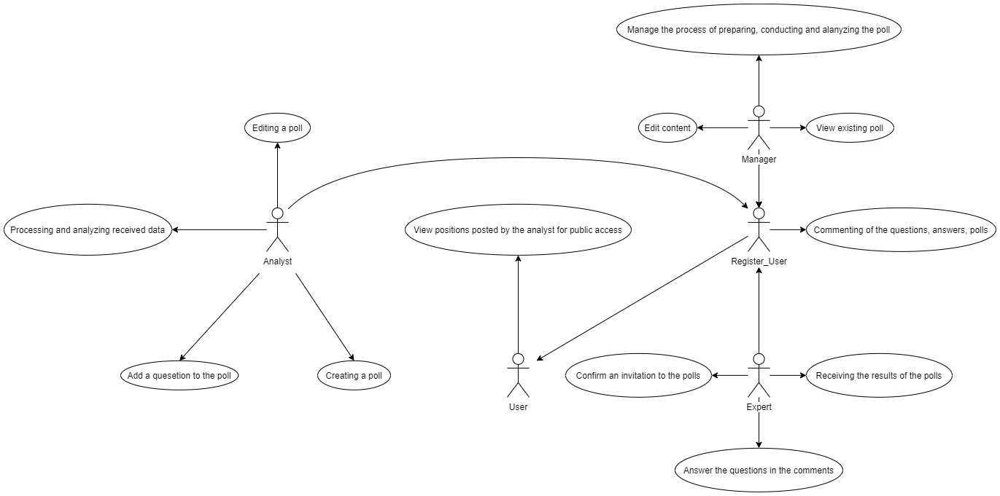

# Назва проєкту. Запити зацікавлених осіб

## Вступ

Даний документ надає описову інформацію для задоволення потреб зацікавлених в сервісі користувачів, в якості яких виступають аналітики та соціологи, проте, в проекті можуть бути зацікавлені студенти, викладачі, менеджери та інші, що ставлять собі за мету організацію опитування експертів (з подальшою роботою над ними).

### Мета 

Метою цієї сукупності вимог є формування функціонального та зручного сервісу, що дозволить його клієнтам з легкістю організовувати опитування експертів, та проводити обробку отриманих даних.  

### Контекст

Цей документ формує технічне завдання для проекту системи організації та управління опитуваннями експертів "SurvExp".

### Основні визначення та скорочення

#### *"Експерт" та "оцінювання"*

**Експерт** - висококваліфікований спеціаліст, який має вищу освіту, відповідну кваліфікацію і професійні знання з питань, що досліджуються, виконує службові обов'язки,  пов'язані з провадженням діяльності у відповідній галузі, безпосередньо проводить експертизу та несе персональну відповідальність за достовірність і повноту аналізу, обґрунтованість висновків відповідно до завдання на проведення експертизи.  

Основні показники експертного потенціалу: 
- Високий рівень інтелекту 
- Значний досвід роботи 
- Визнання колег 
- Активна наукова діяльність 
- Існування публікацій у престижних виданнях 
- Престижна освіта 
- Високий особистий статус

**Експертне оцінювання** - особливий різновид методу опитування, де вимоги, які 
застосовуються  в  масових  опитуваннях,  неприйнятні.  В  процесі  масового 
опитування джерелом соціологічної інформації, яка  дає оцінку  тим  чи  іншим 
сторонам об'єкта дослідження, виступають і представники цього ж об'єкта. При 
експертному опитуванні ситуація інша. Експерти майже ніколи не виступають 
представниками об'єкта дослідження.  

Практика  застосування  експертних  методик  (як  для  вирішення  проблем 
прогнозування,  управління,  так  і  в  традиційних  сферах  соціологічного 
дослідження) показала, що вони такою ж мірою і важливі і надійні, як і метод 
масових  опитувань  з  його  розширеною  методикою  забезпечення 
репрезентативності. Експертні методики містять ряд експліційованих (спільних, 
схожих)  понять:  експертні  системи,  діагностика,  експертне  опитування  та 
оцінювання,  думки,  сценарії.  Але  в  соціології  традиційно  в  експертизі 
акцентується на ролі опитування. Таким чином, експертне опитування посідає 
тут центральне місце.  

#### *Методи експертного оцінювання*  

**Індивідуальні  експертні  методи** –  це  використання  думок  експертів,  які 
сформульовані особисто кожним із них самостійно без врахування думок інших 
експертів.  До  індивідуальних  експертних  методів  належать:  інтерв'ю  та 
анкетування[1, 2].  

- **Метод інтерв’ю** полягає у постановці аналітиком під час бесіди з 
експертом  запитань  про  чинники,  що  визначають  стан  досліджуваного 
об’єкта,  шляхи і  засоби  зміни  стану  об’єкта  у  бажаному  напрямі.  Зміст 
запитань визначає заздалегідь складена програма, яку можна уточнювати 
у  процесі інтерв’ю. Ефективність  цього  методу  визначається:  глибиною 
аналізу  розглянутої  проблеми,  який  передував  опитуванню;  якістю 
програми опитування; методикою її проведення; компетентністю обраних 
експертів для вирішення проблеми.  

- **Метод  анкетування**  ґрунтується  на  самостійній  підготовці 
експертом відповідей на запитання анкети. Однак досвід свідчить, що у 
письмовому  викладі  великого  значення  набувають  такі  суб’єктивні 
фактори,  як  “місцевий  патріотизм”,  небажання  виступати  з  критикою 
товаришів по службі і керівників, скептицизм щодо значення і способів 
дослідження,  неправильне  тлумачення  чи  нерозуміння  запитання, 
звичайне небажання займатися невластивою опитуваному роботою. Усе це 
негативно  позначається  на  якості  аналізу,  проведеного  за  допомогою 
анкетування.  

Основні переваги індивідуальних методів полягають у можливості використання 
здібностей і знань окремого експерта, а також у відносній простоті проведення 
цільового  аналізу.  Основний  їхній  недолік  -  обмеженість  знань  кожного  з 
опитуваних про стан і розвиток суміжних сфер діяльності.  

**Колективні  експертні методи** –  це  методи,  які  забезпечують  формування 
єдиної спільної думки в результаті взаємодії залучених фахівців-експертів. До 
індивідуальних  експертних  методів  належать:  метод  комісії,  методи  Дельфі, 
відстороненого оцінювання, суду.  

Експертне  оцінювання  на  основі  **методу  комісій**  (після  відкритої  дискусії 
шляхом голосування виробляється єдина думка експертів) дає змогу виробити 
найкращу альтернативу для оцінювання конкретної ситуації з урахуванням дії 
комплексу  якісно  різних  факторів.  Недолік  методу,  окрім  відсутності 
анонімності, полягає ще й у тому, що група експертів, які беруть участь у нарадах 
і висловлюють свої судження, керується здебільшого логікою компромісу. При 
цьому  в  учасників  остаточно  сформувалися  оцінки  і  варіанти  вирішення 
проблеми, які не обов’язково ліпші за ті, що висловлені на нараді.  

**Метод  “відстороненого  оцінювання”**  спрямований  на  усунення  вказаного 
недоліку методу комісій. Відповідно до цієї методики робота поділена на два 
періоди: вільного висловлення ідей і критичного аналізу. При цьому обговорення 
організують так, щоб висловлене експертом первинне судження не обтяжувало 
його, а стимулювало до подальшої роботи з аналізу і підготовки рішень.  

Іншим  прикладом  колективного  методу  організації  експертиз  є  **метод  суду**. 
Експертна  комісія  розбивається  на  три  частини.  Перша  -  виступає  в  ролі 
захисників  досліджуваної  ініціативи,  друга  -  намагається  виявити  негативні 
сторони, а третя, за аналогією з судовим засіданням, - регулює хід експертизи та 
виносить остаточне рішення.  

Відмовитись від незручних для експертів форм роботи (наприклад, дискусії за 
“круглим  столом”  чи  інших  видів  обговорення  протилежних  точок  зору)  дає 
можливість  застосування  **методу  Делфі**.  Він  характеризується  такими 
основними  властивостями:  анонімністю,  регульованим  зворотним  зв’язком  і 
груповою  відповіддю.  Анонімність  забезпечується  спеціальною  формою 
опитувального  листка  чи  особливими  прийомами  опитування,  наприклад,  з 
використанням сучасних мультимедійних технологій чи комп’ютерної техніки. 
Опитування зазвичай проводять у 3-4 тури, на кожному з яких за допомогою 
загальновідомих  статистичних  методів  визначають  групову  оцінку. 
Регульованого  зворотного  зв’язку  досягають  завдяки  тому,  що  учасникам 
експертизи  після  кожного  туру  пропонують  ознайомитися  із  колективним 
судженням, пояснити свою можливу незгоду з ним і навіть дають можливість 
переглянути власну первинну оцінку. 

#### *Анкета* 

В деяких методах експертного оцінювання використовують анкети. Анкета [3] - 
структурно  організований  набір  запитань,  кожне  з  яких  логічно  пов'язане  з 
основною метою дослідження.  

Мінімальна конструкція анкети складається з назви, одного питання, та в залежності від типу питання може потребувати хоча б дві відповіді.  

Якість, отриманої інформації залежить, значною мірою, від того, яким чином 
скомпонована або структурована анкета. Побудова анкети повинна складатися з 
трьох частин: 

- Вступна: 
У  першій  частині анкети  пояснюється  мета  дослідження,  гарантується 
анонімність  відповідей,  дається  інструкція  щодо  заповнення,  підкреслюються 
важливість та цінність відповідей респондента. 

- Основна: 
Складається з набору запитань, відповіді на які передбачають виконання завдань 
дослідження.  Ця  частина  анкети  за  змістом  найбільш  вагома  та  складна. 
Запитання  повинні  враховувати  психологічні  особливості  респондентів. 
Запитання  складають  блоками,  у  чіткій  логічній  послідовності.  Головна  мета 
запитань  анкети  полягає  в тому, щоб зацікавити респондента, включити його 
поступово  в  процес  співпраці  з  анкетою.  Далі  пропонуються  запитання 
складніші, які виявляють соціальні установки та орієнтації респондента, оцінки 
та  судження,  які  мають  прямий  стосунок  до  основної  теми  дослідження.  У 
заключній  частині тексту  анкети  пропонуються  найбільш  інтимні  та  різного 
характеру  контрольні  запитання,  мета  яких  —  поглибити  та  уточнити 
інформацію, яка була отримана у відповідях на попередні запитання. 

- Завершальна: 
Остання  частина  анкети  передбачає  подяку  респондентам  та,  можливим  є, 
побажання на майбутнє. 
 
**Види запитань в анкетах**

1. За формою відповідей: 
- закриті (містять повний набір можливих варіантів відповіді): 
 - дихотомічні (відповіді так/ні) 
 - полі варіативні (є декілька варіантів відповіді) 
 - шкальні (наприклад, повністю згоден/згоден частково/не згоден) 
 - табличні 
- напівзакриті  (містять  певні  варіанти  відповіді,  але  можна  також  вказати 
власну); 
- відкриті (передбачають самостійну та розгорнуту відповідь респондентів): 
  - про факти свідомості (думки, враження, судження, мотиви і тд); 
  - про факти поведінки (результати діяльності, вчинки, дії і тд).  
2. За сформованістю запитання: 
- прямі  (спрямовані  на  безпосереднє  та  відкрите  отримання  інформації  від 
респондентів); 
- непрямі  (пов'язані  з  використанням  якоїсь  уявної  ситуації,  яка  дозволить 
приховано дізнатись певну інформацію) 
3. За функціями: 
- інформаційні (основні); 
- фільтри (використовують у випадку, якщо потрібно зібрати інформацію не від 
усіх респондентів, а від певної категорії); 
- контрольні (дають можливість уточнити правильність відповіді респондента). 

#### *Результати роботи експертної системи* 

Результатом роботи експертної системи є статистичні данні, які систематизують 
для [4]: 
- Побудови,  або  поповнення  моделі  властивостей  об'єкта  на  основі  оцінок 
експертів і їх аргументації. 
- Оцінити узгодженість думок експертів. За відсутності значимої узгодженості 
експертів необхідно виявити причини неузгодженості (наявність груп), оцінити 
помилку дослідження.  

Також  до  позитивних  сторін  результатів  роботи  експертної  системи  можна 
віднести  нівелювання  помилок  окремих  експертів  і  вироблення  єдино-
правильної позиції чи прийняття кваліфікованого рішення.  

Але,  слід  зауважити,  що  метод  експертних  оцінок  не  може  замінити  ні 
адміністративних,  ні  планових  рішень,  він  лише  дозволяє  поповнити 
інформацію, необхідну для підготовки і прийняття таких рішень. Використання 
результатів експертних оцінок доцільно тільки там, де неможливо застосувати 
більш точні методи.  

На сьогоднішній день склалася певна технологія розробки експертних систем, 
що включає 6 етапів: 

- Етап 1. Ідентифікація 
Визначаються  завдання,  які  підлягають  вирішенню.  Планується  хід  розробки 
прототипу експертної системи, визначаються: потрібні ресурси (час, люди, ЕОМ 
і  т.д.),  джерела  знань  (книги,  додаткові  фахівці,  методики),  наявні  аналогічні 
експертні системи, мети (поширення досвіду, автоматизація рутинних дій і ін .), 
класи розв'язуваних завдань і т.д. Етап ідентифікації - це знайомство і навчання 
колективу розробників. Середня тривалість 1-2 тижні. 
На цьому ж етапі розробки експертних систем проходить витяг знань. Інженер 
по знаннях допомагає експерту виявити і структурувати знання, необхідні для 
роботи  експертної  системи,  з  використанням  різних  способів:  аналіз  текстів, 
діалоги,  експертні  ігри,  лекції,  дискусії,  інтерв'ю,  спостереження  та  інші. 
Вилучення знань - це отримання інженером по знаннях більш повного уявлення 
про предметну область і методи прийняття рішення в ній. Середня тривалість 1-
3 місяці. 

- Етап 2. Концептуалізація 
Виявляється структура отриманих знань про предметну область. Визначаються: 
термінологія,  перелік  основних  понять  і  їх  атрибутів,  структура  вхідної  та 
вихідної  інформації,  стратегія  прийняття  рішень  і  т.д.  Концептуалізація  -  це 
розробка неформального опису знань про предметну область у вигляді графа, 
таблиці, діаграми або тексту, яке відображає основні концепції і взаємозв'язки 
між поняттями предметної області. Середня тривалість етапу 2-4 тижні. 

- Етап 3. Формалізація 
На  етапі  формалізації  всі  ключові  поняття  і  відносини,  виявлені  на  етапі 
концептуалізації,  виражаються  на  деякій  формальній  мові,  запропонованому 
(обраному)  інженером  по  знаннях.  Тут  він  визначає,  чи  підходять  наявні 
інструментальні  засоби  для  вирішення  даної  проблеми  або  необхідний  вибір 
іншого інструментарію, або потрібні оригінальні розробки. Середня тривалість 
1-2 місяці. 

- Етап 4. Реалізація 
Створюється  прототип  експертної  системи,  що  включає  базу  знань  і  інші 
підсистеми.  На  даному  етапі  застосовуються  такі  інструментальні  засоби: 
програмування  на  звичайних  мовах  (Java,  C  та  ін.).  Четвертий  етап  розробки 
експертних систем в якійсь мірі є ключовим, тому що тут відбувається створення 
програмного  комплексу,  який  демонструє  життєздатність  підходу  в  цілому. 
Середня тривалість 1-2 місяці. 

- Етап 5. Тестування 
Прототип перевіряється на зручність і адекватність інтерфейсів вводу-виводу, 
ефективність стратегії управління, якість перевірочних прикладів, коректність 
бази знань. Тестування - це виявлення помилок в обраному підході, виявлення 
помилок в реалізації прототипу, а також вироблення рекомендацій з доведення 
системи до промислового варіанту. 

- Етап 6. Дослідна експлуатація 
Перевіряється  придатність  експертної  системи  для  кінцевих  користувачів.  За 
результатами  цього  етапу  може  знадобитися  суттєва  модифікація  експертної 
системи.  

Процес  розробки  експертної  системи  не  зводиться  до  суворої  послідовності 
перерахованих вище етапів. В ході робіт доводиться неодноразово повертатися 
на більш ранні етапи і переглядати прийняті там рішення.

### Посилання

[1] Навчальний посібник «Теорія економічного аналізу» Автор: Купалова 
Г.І. Видавництво: «ЗНАННЯ» Рік: 2008 Сторінки: 639  

[2] Методологія експертного оцінювання: конспект лекцій / уклад. : В. П. 
Новосад, Р. Г. Селіверстов. - К. : НАДУ, 2008. - 48 с. 
 
[3] https://uk.wikipedia.org/wiki/%D0%90%D0%BD%D0%BA%D0%B5%D1%82%D0%B0 
 
[4] http://ukrbukva.net/page,10,64178-Metody-ekspertnyh-ocenok.html 

## Короткий зміст

1. Характеристика ділових процесів.
2. Короткий огляд продукту.
3. Основні параметри проекту (функціональність, практичність, надійність, продуктивність, експлуатаційна придатність).

## Характеристика ділових процесів

### 1. Призначення сервісу для опитувань  

Функціональність сервісу опитувань призначена для надання послуг з створення і проходження анкет, а також збору і обробки результатів опитувань. Результатом роботи сервісу є отримання клієнтом зібраних даних.

### 2. Взаємодія з клієнтом  

Клієнти можуть в будь-який момент зв’язатися з сервіс-менеджером, що обслуговує  користувачів через систему технічної підтримки для отримання необхідної допомоги у вирішенні виниклих питань.

### 3. Діаграма юзкейсів  

  

### 4.1 Сценарій реєстрації нового користувача

**ID**: SE-1.1  
**НАЗВА**: Реєстрація нового користувача  
**УЧАСНИКИ**: Система; Користувач; Експерт  
**ПЕРЕДУМОВИ**: Запит на створення нового облікового запису  
**РЕЗУЛЬТАТ**: Створення нового облікового запису користувача  
**ВИКЛЮЧНІ СИТУАЦІЇ**: Експерт відхилив запит на створення нового облікового запису  
**ОСНОВНИЙ СЦЕНАРІЙ**:  
1. Користувач натискає кнопку «Create profile».  
2. Система пропонує форму «Create new user».  
3. Користувач заповнює поля: логін, пароль, прізвище, ім’я, e-mail, сфера діяльності.  
4. Користувач підтверджує правильність введених даних.  
5. Система перевіряє введені дані.  
6. На електронну пошту, вказану користувачем при реєстрації, система посилає листа з кодом для підтвердження адреси електронної пошти.  
7. Користувач вводить отриманий код.   
8. Система надає доступ до створеного акаунту.

### 4.2 Сценарій створення та реалізації користувачем нового опитування  

**ID**: SE-1.2  
**НАЗВА**: Cтворення нового опитування  
**УЧАСНИКИ**: Аналітик; Система; Експерт; Менеджер  
**ПЕРЕДУМОВИ**: Запит на створення нового опитування у менеджера  
**РЕЗУЛЬТАТ**: формування анкет та відправлення запрошень експертам  
**ВИКЛЮЧНІ СИТУАЦІЇ**:  
1.	Аналітик перервав процес формування анкети не завершивши її.  
2. Аналітик завершив процес редагування опитування порушивши мінімальну конструкцію анкети.  

**ОСНОВНИЙ СЦЕНАРІЙ**:  
1. Аналітик натискає кнопку «Create a poll».  
2. Система пропонує форму «New poll».  
3. Аналітик заповнює поле «Poll title» та додає принаймні одне питання.  
4. Аналітик завершує редагування анкети натисканням кнопки «Done» та надсилає запрошення експертам натисканням кнопки «Share».  
5. Система опрацьовує анкету та надсилає запрошення експертам.

### 4.3 Сценарій додавання питання

**ID**: SE-1.3  
**НАЗВА**: Додавання питання  
**УЧАСНИКИ**: Аналітик; Система;   
**ПЕРЕДУМОВИ**: Наявність анкети.  
**РЕЗУЛЬТАТ**: Анкета, яке містить питання.  
**ВИКЛЮЧНІ СИТУАЦІЇ**: Аналітик перервав процес додавання питання  
**ОСНОВНИЙ СЦЕНАРІЙ**:  
1. Аналітик натискає кнопку «Add question».  
2. Система пропонує форму «New question».  
3. Аналітик заповнює поле «Type of question».  
4. Система пропонує форму питання згідно обраному типу.  
5. Аналітик заповнює поле «Question», «Answer» та по бажанню поле «Description».  

### 4.4 Сценарій проходження опитування

**ID**: SE-1.4  
**НАЗВА**: Проходження опитування  
**УЧАСНИКИ**: Експерт; Система;  
**ПЕРЕДУМОВИ**: Отримання запрошення на участь в опитуванні.  
**РЕЗУЛЬТА**Т: Заповнена анкета.  
**ВИКЛЮЧНІ СИТУАЦІЇ**:  Експерт перервав процес заповнювання анкети  
**ОСНОВНИЙ СЦЕНАРІЙ**:  
1. Експерт натискає кнопку «Start the survey».  
2. Система пропонує форму «Poll for experts».  
3. Експерт заповнює поля з відповідями.  
4. Експерт натискає кнопку «Send».  
5. Система зберігає відповіді. 

### 4.5 Сценарій авторизації користувача

**ID**: SE-1.5  
**НАЗВА**: Авторизація користувача  
**УЧАСНИКИ**: Користувач; Система;   
**ПЕРЕДУМОВИ**: Наявність облікового запису у користувача.  
**РЕЗУЛЬТАТ**: Успішна авторизація в системі.  
**ВИКЛЮЧНІ СИТУАЦІЇ**:  Користувач ввів некоректні дані.  
**ОСНОВНИЙ СЦЕНАРІЙ**:  
1. Користувач натискає кнопку «Sign in».  
2. Система пропонує форму «Authentication».  
3. Користувач заповнює поля «E-mail», «Password».  
4. Користувач натискає кнопку «Login».  
5. Система авторизує користувача. 

## Короткий огляд продукту

Система організації та управління опитуваннями експертів:  

- бази  знань  призначеної  для  зберігання  вихідних  і  проміжних  фактів  в 
робочій пам'яті і зберігання моделей і правил маніпулювання моделями в 
базі правил;  
- організатора опитувань, який  забезпечує організацію опитування, його 
структуру та взаємозв’язки з іншими компонентами;  
- компонента  проведення  опитування,  який  забезпечує  реалізацію 
опитування на базі інших компонентів експертної системи(бази знань та 
організатора опитувань).  

## Функціональність

Основні вимоги до функціональності, що пред’являються зацікавленими особами до предмета розробки, відносяться до чотирьох категорій:  
- Менеджер  
- Користувач:  
  - Експерт  
  - Аналітик  
 
**1. Можливості «Менеджер»:** 
- Проглядати існуючі опитування; 
- Коментувати питання, відповіді, опитування; 
- Отримувати результати опитувань; 
- Керувати процесом підготовки, проведення та аналізування опитування 
- Редагувати/коригувати контент.  

**2. Можливості «Користувач»:**  

**2.1 Можливості «Експерт»:** 
- Підтверджувати запрошення на опитування;  
- Відповідати на питання в опитуваннях;  
- Отримувати результати опитувань. 

**2.2  Можливості «Аналітик»:**  
- Створювати опитування;  
- Редагувати опитування;  
- Оброблювати та аналізувати отриманні результати.  

## Практичність

Основні вимоги до практичності, що пред’являються зацікавленими особами до предмета розробки полягають в зручності інтерфейсу системи.  

## Надійність

Основні вимоги до надійності, що пред’являються зацікавленими особами до предмета розробки полягають в регулярному здійсненню резервного копіювання баз даних. 

## Продуктивність

Основні вимоги до продуктивності, що пред’являються зацікавленими особами до предмета розробки полягають в тому, щоб максимально можлива кількість експертів, що одночасно проходять опитування, доходила до 10 людей та система стабільно працювала.

## Експлуатаційна придатність

Основні вимоги до експлуатаційної придатності, що пред’являються зацікавленими особами до предмета розробки полягають в постійній підтримці системи, що полягає в тому, що протягом вказаного у договорі періоду часу систему можна буде модифікувати, відповідно до потреб зацікавлених осіб.
